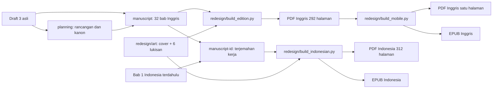

# Peta folder dan alur kerja Schlelberg

**Status peta:** 29 September 2026. Dokumen ini menjelaskan isi `work/` dan `outputs/` untuk pembaca manusia maupun untuk bahan visualisasi proyek. Path di bawah relatif terhadap folder proyek `files-mentioned-by-the-user-schlelberg/`.

## Cara membaca status

| Status | Makna |
|---|---|
| **Aktif — sumber** | Berkas yang harus diedit bila isi cerita atau gambar edisi sekarang berubah. |
| **Aktif — hasil** | Berkas terbaru yang dibaca atau dibagikan. Biasanya dibuat ulang dari sumber. |
| **Acuan** | Membantu keputusan editorial/desain, tetapi tidak otomatis mengalahkan naskah final. |
| **Perantara / QA** | Bahan proses, hasil render, pemeriksaan, atau cache. Bukan berkas untuk pembaca. |
| **Historis / tergantikan** | Disimpan agar riwayat kerja tidak hilang. Jangan dipakai sebagai dasar edisi terbaru. |

**Urutan kebenaran cerita:** keputusan terbaru penulis → naskah bab yang aktif → rencana cerita yang masih cocok dengan naskah → analisis dan draf asal. Rencana dan catatan lama bisa berisi target atau status yang sudah kedaluwarsa.

## Peta singkat

```text
files-mentioned-by-the-user-schlelberg/
├─ work/                            bahan kerja; sebagian aktif, sebagian historis
│  ├─ manuscript/                  32 bab Inggris, SUMBER UTAMA isi edisi Inggris
│  ├─ manuscript-id/               32 bab Indonesia, sumber edisi ID; perlu sunting sastra
│  ├─ planning/                    rancangan 32 bab, aturan dunia, kanon nama
│  ├─ project-memory/              analisis dan indeks keputusan editorial
│  ├─ redesign/
│  │  ├─ art/                     gambar AKTIF untuk cover dan enam ilustrasi
│  │  ├─ reference/               contoh desain buku terbitan lain
│  │  ├─ qa/ dan qa-id/            render untuk pemeriksaan visual
│  │  ├─ translation-cache/        hasil antara penerjemahan; BUKAN teks final
│  │  └─ *.py, *.pdf, *.json       pembangun, pemeriksa, PDF dan peta halaman perantara
│  ├─ cover/, illustrations/        gambar edisi lama
│  ├─ book-qa/                     pemeriksaan visual edisi lama
│  └─ archive/                     keadaan sebelum penggantian nama karakter
└─ outputs/                         berkas yang pernah diserahkan
   ├─ PDF dan EPUB edisi terbaru
   ├─ redesigned hardcover jacket  konsep sampul jaket terbaru
   ├─ schlelberg-planning-package/ salinan paket rancangan
   ├─ project-memory/             salinan analisis lama
   └─ PDF/DOCX terdahulu           disimpan sebagai riwayat, bukan edisi aktif
```

File gambar halaman di `qa/` berjumlah ratusan, dan `translation-cache/` berisi 200 potongan hasil antara. Nama-nama individualnya sengaja diringkas dengan pola `page-*.png` dan `NN-NNN.json` karena semua mempunyai fungsi yang sama.

## Alur produksi yang berlaku sekarang



Panah menunjukkan hubungan asal atau pemakaian, bukan klaim bahwa setiap kalimat naskah Inggris merupakan terjemahan langsung dari dokumen awal. Alur terjemahan Indonesia menggunakan naskah Inggris final; Bab 1 mengambil terjemahan sastra yang sebelumnya sudah dibuat lalu disesuaikan dengan nama dan akhir bab yang terbaru. Bab 2–32 merupakan terjemahan berbantuan mesin dengan pembenahan istilah dasar; **belum melalui penyuntingan sastra menyeluruh**.

## `work/`: bahan kerja dan sumber

### 1. Cerita dan keputusan editorial

| Path | Status | Isi dan kapan dipakai |
|---|---|---|
| [`work/manuscript/01-*.md` sampai `32-*.md`](../work/manuscript/) | **Aktif — sumber** | Seluruh prosa novel **bahasa Inggris**, 32 bab. Inilah sumber isi edisi Inggris yang sekarang. Nama file bernomor agar urutan bab stabil. Jangan mengedit PDF untuk mengubah cerita; ubah bab di sini lalu bangun ulang. |
| [`work/manuscript-id/01-*.md` sampai `32-*.md`](../work/manuscript-id/) | **Aktif — sumber terjemahan kerja** | Seluruh prosa edisi **bahasa Indonesia** yang masuk ke PDF/EPUB ID. Nomor dan nama file mengikuti bab Inggris agar mudah dipasangkan. Status bahasanya masih draf terjemahan. |
| [`work/manuscript/execution-ledger.md`](../work/manuscript/execution-ledger.md) | Acuan proses, sebagian historis | Catatan perkembangan penulisan dan kontinuitas per bab. Bagian yang mengatakan artefak buku belum ada sudah kedaluwarsa. |
| [`work/manuscript/revision-map.md`](../work/manuscript/revision-map.md) | Acuan editorial | Daftar masalah dan lintasan revisi yang pernah diidentifikasi. Periksa lagi terhadap prosa saat ini sebelum menerapkannya. |
| [`work/planning/`](../work/planning/) | **Acuan cerita utama** | Blueprint 32 bab: aturan dunia, tokoh, urutan peristiwa, rahasia, payoff, batas kekuatan, akhir Tobious–Mariya, dan kanon nama. Dipakai untuk mengecek arah dan konsistensi; prosa terkini tetap perlu dibaca untuk mengetahui kejadian yang benar-benar tertulis. |
| [`work/project-memory/`](../work/project-memory/) | Acuan analisis | Sepuluh modul peta manuskrip asal, DNA cerita, tokoh, dunia, linimasa, informasi/rahasia, setup/payoff, arsitektur baru, kerangka bab, dan keputusan revisi. Ini adalah bahan berpikir yang lebih tua daripada hasil akhir buku. |
| [`work/naming-session.md`](../work/naming-session.md) | Acuan keputusan | Riwayat pemilihan nama oleh penulis. Daftar nama yang lebih mudah dipakai sehari-hari ada di `work/planning/naming-canon.md`. |
| [`work/PROJECT.md`](../work/PROJECT.md) | **Historis / status usang** | Ringkasan proyek yang ditulis sebelum artefak novel dan edisi ilustrasi selesai. Jangan menganggap kalimat “belum ada buku final” sebagai status terkini. |

**Isi `work/planning/` yang paling berguna untuk visualisasi cerita:**

| Berkas | Peran |
|---|---|
| `00-START-HERE.md`, `README-ID.md`, `handover.md` | Orientasi, urutan baca, dan konteks keputusan. |
| `01-story-contract.md` | Premis, tema, struktur besar, dan bentuk akhir. |
| `02-world-and-rules.md` | Aras, Veyr, linimasa, perisai, Severance, Para Iwang, dan aturan portal. |
| `03-character-bible.md`, `naming-canon.md` | Kepribadian, hubungan, arc, nama serta panggilan resmi. |
| `04-chapters-01-08.md` sampai `07-chapters-25-32.md` | Kartu adegan untuk 32 bab. Ini **rencana**, bukan teks novel yang diterbitkan. |
| `08-continuity-and-timeline.md` | Tanggal, geografi, pergerakan, luka, jumlah tawanan/korban, benda penting. |
| `09-reveals-and-payoffs.md` | Kapan informasi diperkenalkan, dibalik, dan dibayar. |
| `10-execution-protocol.md`, `11-editorial-audit.md`, `validation.md` | Cara penulisan awal dan hasil cek terhadap rancangan. Beberapa kalimatnya menyebut novel belum ditulis karena berasal dari fase sebelumnya. |

### 2. Gambar yang dipakai edisi sekarang

Semua gambar aktif ada di [`work/redesign/art/`](../work/redesign/art/). Nama file pada ilustrasi menunjuk **bab setelah mana** gambar ditempatkan, bukan nomor halaman.

| Gambar | Status | Fungsi |
|---|---|---|
| `cover-aura.png` | **Aktif — sumber** | Lukisan sampul Tobious berdiri; dipakai PDF Inggris dan Indonesia serta jaket terbaru. Huruf judul ditata terpisah dalam PDF. |
| `01-aras.png` | **Aktif — sumber** | Aras saat pendudukan dan penyerahan benih; juga dipakai pada bagian bawah sampul belakang. |
| `05-veyr.png` | **Aktif — sumber** | Pandangan pertama atas kota Veyr. |
| `09-severance.png` | **Aktif — sumber** | Latihan Severance dan perisai. |
| `14-hollow.png` | **Aktif — sumber** | Mariya, Nerissa, Lios, dan Para Iwang di kompleks bawah. |
| `28-rescue.png` | **Aktif — sumber** | Penyelamatan tawanan; komposisi akhir menjaga wajah pasien dari lipatan tengah. |
| `31-concourse.png` | **Aktif — sumber** | Potongan akar dan kerusakan jalur kota pada klimaks. |
| `visual-bible.png` | Acuan visual | Lembar konsistensi Tobious, Mariya, pedang, dan bentuk Iwang; **tidak** dicetak sebagai halaman buku. |
| `cover.png` | Historis / tergantikan | Konsep pose sampul sebelum `cover-aura.png`. Jangan pilih untuk desain terbaru. |

Ilustrasi naskah PDF dicetak sebagai **satu lukisan horizontal pada dua halaman berhadapan**. PDF satu-halaman menampilkan kedua bagiannya secara berurutan. EPUB memasukkan lukisan utuh dan pembaca EPUB menyesuaikannya dengan layar. Wajah Tobious pada gambar aktif memakai foto rujukan yang diberikan penulis; foto itu berada di luar dua folder ini dan tidak termasuk hasil yang dibagikan.

### 3. Mesin buku, bahan antara, dan pemeriksaan

| Path | Status | Fungsi |
|---|---|---|
| [`work/redesign/build_edition.py`](../work/redesign/build_edition.py) | Aktif — pembangun | Membaca `work/manuscript/` dan `work/redesign/art/`, menyusun interior Inggris, front matter, daftar isi bertaut, enam bentangan, PDF pembaca bentangan, dan jaket terbaru. |
| [`work/redesign/build_mobile.py`](../work/redesign/build_mobile.py) | Aktif — pembangun | Membuat PDF Inggris dengan tampilan satu halaman dan EPUB Inggris dari naskah serta gambar aktif. |
| [`work/redesign/build_indonesian.py`](../work/redesign/build_indonesian.py) | Aktif — pembangun | Membaca `work/manuscript-id/`, memakai gambar aktif, menghasilkan PDF dan EPUB Indonesia. Sampul EPUB mengambil render `qa-id/cover.png` dari halaman pertama PDF Indonesia. |
| `work/redesign/body.pdf`, `frontmatter.pdf`, `covers.pdf` | Perantara | Komponen PDF Inggris sebelum digabung; bukan produk akhir. |
| `work/redesign/body-id.pdf`, `frontmatter-id.pdf`, `covers-id.pdf` | Perantara | Komponen PDF Indonesia sebelum digabung. |
| `work/redesign/layout.json`, `layout-id.json` | Perantara / data visualisasi | Nomor halaman awal bab, lokasi enam ilustrasi, offset front matter, dan jenis halaman. Gunakan ini jika membuat diagram halaman atau peta ritme ilustrasi. |
| `work/redesign/verify_edition.py`, `verify_mobile.py`, `verify_indonesian.py`, `check_reader.py` | QA | Memeriksa jumlah bab, kecocokan teks, daftar isi, batas halaman, struktur EPUB, dan tautan pembaca. |
| `work/redesign/qa/pages/page-*.png`, `qa/sheets/sheet-*.png` | QA | Render dan lembar kontak edisi Inggris untuk inspeksi visual. Sebagian adalah snapshot fase produksi dan bisa lebih tua daripada PDF terakhir; render ulang dari PDF bila butuh gambar pasti terbaru. |
| `work/redesign/qa-id/page-*.png` | QA | Sampel halaman Indonesia yang dirender untuk pemeriksaan. `qa-id/cover.png` juga menjadi aset sampul EPUB Indonesia. |
| `work/redesign/qa/verification.json` | QA | Ringkasan pemeriksaan edisi Inggris. |
| `work/redesign/reference/` | **Acuan desain eksternal** | Sampel/lembar resmi penerbit dan cuplikan gambar untuk meneliti hierarki sampul, tata huruf, dan halaman novel. Ini **bukan** referensi plot atau karakter Schlelberg. |
| `work/redesign/design-notes.md` | Acuan desain | Keputusan visual, konsistensi gambar, tipografi, dan referensi. |
| `work/redesign/cover-proof.pdf`, `type-proof.pdf`, beberapa PNG proof | Historis / QA | Percobaan tata letak sebelum artefak akhir. |
| `work/redesign/translation-cache/NN-NNN.json` | Perantara | 200 potongan hasil penerjemahan otomatis. **Jangan jadikan sumber teks final atau menjalankan ulang penerjemahan di atas suntingan baru.** Teks edisi Indonesia yang dipakai ada di `work/manuscript-id/`. |
| `work/redesign/translate_indonesian.py`, `polish_translation_terms.py`, `translate_probe.py` | Riwayat proses | Program yang menghasilkan draf terjemahan dan menyelaraskan beberapa istilah. `translate_probe.py` hanya percobaan. Jangan jalankan ulang jika ada penyuntingan manual, karena dapat menimpa pekerjaan tersebut. |

`work/redesign/art/` adalah folder gambar **terkini**. Folder [`work/cover/`](../work/cover/) dan [`work/illustrations/`](../work/illustrations/) berisi generasi gambar sebelumnya; [`work/book-qa/`](../work/book-qa/) adalah render dan pemeriksaannya. Program lama `work/build_schlelberg.py`, `work/assemble_illustrated_pdf.py`, dan `work/qa_schlelberg.py` dibuat untuk edisi itu, bukan edisi yang sekarang. `work/build_planning_package.py` membangun paket rancangan, sedangkan `work/apply_character_names.py` merekam migrasi nama pada fase rencana.

### 4. Arsip dan ekstraksi sumber awal

| Path | Status | Keterangan |
|---|---|---|
| `work/manuscript-correct.txt` | Acuan asal | Ekstraksi teks dari **Schlelberg - Draft 3 (1).docx**, dokumen asli yang benar. Naskah Inggris final sudah merekonstruksi ceritanya; jangan mengimpor isi lama tanpa membandingkan kanon terkini. |
| `work/manuscript.txt` | **Sumber salah, jangan dipakai** | Ekstraksi dari berkas BJB yang kemudian dibatalkan penulis. Nama Hadni pada isinya adalah penanda jelas bahwa berkas ini bukan sumber Schlelberg yang berlaku. |
| `work/archive/before-character-renaming-v1/` | Arsip | Draf Bab 1, rencana, dan ZIP sebelum nama-nama final disetujui. |
| `work/project-memory/archive/before-complete-plan/` | Arsip | Snapshot analisis sebelum rencana 32 bab selesai. |
| `work/PROJECT-before-complete-plan.md` | Arsip | Catatan status sebelum rencana selesai. |
| `work/__pycache__/`, `work/redesign/__pycache__/` | Cache teknis | Berkas Python yang dibuat otomatis. Tidak berisi keputusan cerita. |

## `outputs/`: hasil yang dapat dibaca

### Edisi terbaru

| Berkas | Status | Fungsi dan sumber |
|---|---|---|
| [`Schlelberg - edisi bahasa Indonesia.pdf`](./Schlelberg%20-%20edisi%20bahasa%20Indonesia.pdf) | **Aktif — hasil** | Novel Indonesia 312 halaman, tampilan satu halaman; sumber `work/manuscript-id/` dan gambar aktif. |
| [`Schlelberg - edisi bahasa Indonesia.epub`](./Schlelberg%20-%20edisi%20bahasa%20Indonesia.epub) | **Aktif — hasil** | Novel Indonesia yang menyesuaikan ukuran layar, isi dan enam gambar sama. Terjemahannya masih perlu sunting sastra. |
| [`Schlelberg - single-page edition.pdf`](./Schlelberg%20-%20single-page%20edition.pdf) | **Aktif — hasil** | Novel Inggris 292 halaman, disetel terbuka satu halaman pada satu waktu. |
| [`Schlelberg - illustrated edition.epub`](./Schlelberg%20-%20illustrated%20edition.epub) | **Aktif — hasil** | EPUB Inggris dari 32 bab dan enam lukisan. |
| [`Schlelberg - redesigned illustrated edition.pdf`](./Schlelberg%20-%20redesigned%20illustrated%20edition.pdf) | **Aktif — hasil dasar** | PDF Inggris 292 halaman dengan halaman potret yang berpasangan untuk ilustrasi; sumber bagi PDF single-page dan facing-page reader. |
| [`Schlelberg - facing-page reader.pdf`](./Schlelberg%20-%20facing-page%20reader.pdf) | **Aktif — hasil alternatif** | 147 halaman PDF layar lebar agar setiap pasangan halaman terlihat sekaligus. Tidak cocok dijadikan satu-satunya master cetak. |
| [`Schlelberg - redesigned hardcover jacket.pdf`](./Schlelberg%20-%20redesigned%20hardcover%20jacket.pdf) | **Aktif — konsep visual** | Jaket Inggris: flap belakang, sampul belakang, punggung, sampul depan, flap depan. Lebar punggung masih provisional dan harus disesuaikan dengan spesifikasi percetakan. Belum ada jaket terpisah berteks Indonesia. |
| [`Schlelberg - visual direction.md`](./Schlelberg%20-%20visual%20direction.md) | Acuan desain | Catatan sumber visual, referensi, dan prompt gambar yang tersimpan. Cocok sebagai masukan untuk visualisasi gaya, **bukan** sinopsis plot. |

### Paket rencana dan sumber referensi

| Berkas/folder | Status | Fungsi |
|---|---|---|
| [`outputs/schlelberg-planning-package/`](./schlelberg-planning-package/) | Salinan rencana | Paket modular yang pernah diserahkan untuk menjalankan penulisan 32 bab. Isinya salinan `work/planning/` saat paket dibuat, plus panduan dan folder `reference/`. Lebih mudah dibagikan; untuk kerja lanjut gunakan `work/planning/` dan cek prosa aktual. |
| [`outputs/schlelberg-planning-package.zip`](./schlelberg-planning-package.zip) | Salinan kemasan | Versi ZIP paket di atas. Bukan naskah novel. |
| [`outputs/SCHLELBERG-MASTER-PLAN.md`](./SCHLELBERG-MASTER-PLAN.md) | Indeks rencana | Satu dokumen pengantar menuju modul paket. Menyebut target 93.200 kata sebagai **anggaran rencana**, bukan panjang aktual novel. |
| `outputs/schlelberg-planning-package/reference/Schlelberg - Draft 3 (1).docx` | Acuan asal yang benar | Salinan DOCX asli yang benar. Dokumen BJB yang salah tidak ada di paket. |
| `outputs/schlelberg-planning-package/reference/01-the-kings-measure.md` | Snapshot lama | Bab 1 ketika paket rencana dibuat; **bukan** versi 32 bab final. |
| [`outputs/project-memory/`](./project-memory/) | Historis | Salinan lebih lama dari sepuluh berkas analisis; tidak identik seluruhnya dengan `work/project-memory/` dan bukan kanon final. |
| [`outputs/manuscript/01-takaran-sang-raja.md`](./manuscript/01-takaran-sang-raja.md) | Referensi terjemahan | Bab 1 Indonesia yang lebih dulu ditulis dengan nama lama. Isinya disesuaikan dan dipakai sebagai dasar `work/manuscript-id/01-the-kings-measure.md`; file aslinya tetap disimpan tanpa perubahan. |

### Hasil generasi sebelumnya

| Berkas | Status | Mengapa disimpan |
|---|---|---|
| `Schlelberg - novel.docx` | **Historis / tergantikan** | Novel Inggris dalam DOCX dari tata buku lebih awal. Bukan master desain atau gambar terbaru. |
| `Schlelberg - novel interior.pdf` | **Historis / tergantikan** | PDF interior Inggris 234 halaman sebelum desain ilustrasi terbaru. |
| `Schlelberg - illustrated novel.pdf` | **Historis / tergantikan** | PDF ilustrasi Inggris 241 halaman dari generasi sampul dan tata letak sebelumnya. |
| `Schlelberg - hardcover jacket concept.pdf` | **Historis / tergantikan** | Konsep jaket sebelum cover Tobious berdiri dan merek Sulastony Co. |

## Jika ingin membuat visualisasi dari proyek ini

Gunakan simpul dan relasi di bawah sebagai dataset sederhana. **Jangan** jadikan setiap PNG QA atau JSON cache sebagai simpul cerita; gabungkan per kelompok.

| ID simpul | Path yang diwakili | Kategori | Hubungan utama |
|---|---|---|---|
| `source_original` | `outputs/schlelberg-planning-package/reference/Schlelberg - Draft 3 (1).docx` | Asal historis yang benar | Menginspirasi rekonstruksi dan dianalisis oleh `memory`. |
| `memory` | `work/project-memory/` | Analisis | Membantu `plan`. |
| `plan` | `work/planning/` | Rancangan/kanon desain | Membimbing `manuscript_en`; jangan digambar sebagai hasil final. |
| `manuscript_en` | `work/manuscript/01-*.md`…`32-*.md` | Prosa Inggris aktif | Masuk ke `pdf_en`, `epub_en`, dan `manuscript_id`. |
| `manuscript_id` | `work/manuscript-id/01-*.md`…`32-*.md` | Draf terjemahan aktif | Masuk ke `pdf_id` dan `epub_id`; memerlukan penyuntingan sastra. |
| `visual_bible` | `work/redesign/art/visual-bible.png` | Acuan gambar | Mengarahkan `art_active`. |
| `art_active` | `work/redesign/art/cover-aura.png` + enam lukisan | Gambar aktif | Masuk ke seluruh PDF/EPUB terbaru. |
| `pdf_en` | `outputs/Schlelberg - redesigned illustrated edition.pdf` | PDF Inggris dasar | Menurunkan PDF satu halaman dan pembaca bentangan. |
| `epub_en` | `outputs/Schlelberg - illustrated edition.epub` | EPUB Inggris | Turunan `manuscript_en` + `art_active`. |
| `pdf_id` | `outputs/Schlelberg - edisi bahasa Indonesia.pdf` | PDF Indonesia | Turunan `manuscript_id` + `art_active`. |
| `epub_id` | `outputs/Schlelberg - edisi bahasa Indonesia.epub` | EPUB Indonesia | Turunan `manuscript_id` + `art_active`; sampul dirender dari `pdf_id`. |
| `legacy` | `work/cover/`, `work/illustrations/`, empat keluaran lama | Arsip desain | Tidak mengalir ke edisi aktif. |

Untuk **peta alur cerita**, mulai dari `work/planning/04-...` sampai `07-...`, lalu cocokkan dengan bab sebenarnya di `work/manuscript/`. Untuk **linimasa dan aturan dunia**, pakai `work/planning/02-world-and-rules.md` serta `08-continuity-and-timeline.md`, dengan naskah sebagai pemeriksaan akhir. Untuk **visualisasi proses produksi**, gunakan graf di atas dan `work/redesign/layout.json` / `layout-id.json` bila butuh koordinat bab serta penempatan ilustrasi.

**Hal yang mudah tertukar:** `work/manuscript.txt` adalah berkas BJB yang dibatalkan; `work/manuscript-correct.txt` berasal dari draft yang benar, tetapi tetap naskah asal lama. `work/PROJECT.md` dan beberapa `validation.md` merekam fase sebelum buku selesai. `outputs/project-memory/` bukan salinan identik dari versi kerja, dan `work/redesign/translation-cache/` bukan sumber teks Indonesia yang boleh diedit.
